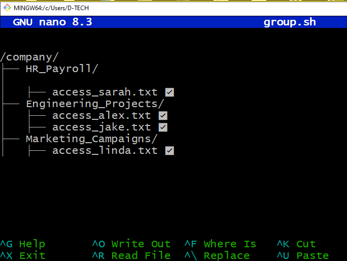

**ACCESS CONTROL TASK**

1.  **Identify Violations.**

We had a virtual meeting, and reviewed each of the three folders
(HR_Payroll, Engeneering_Projects and Marketing_Campaigns). The
violation we identified was Alex who had access to HR_Payroll which
should not have been so.

2.  **Fix the permissions**

We fixed the permissions by removing **access_alex.txt** from
**/company/HR_Payroll/** to revoke Alex's unauthorized access.

This was simulated by simply deleting the text file that said Alex had
access. We also took a screenshot of the fixed document structure.

3.  **Justify Your Fixes**

**Who Had Improper Access?**

First of all, what was Alex doing in the HR_Payroll? We all discussed
and laughed -- well, maybe he wanted to increase his salary. On a more
serious note, Alex, an Intern, had unauthorized access to the HR_Payroll
folder, which was restricted to Sarah, HR Manger. This was evident from
access_alex.txt in /company/HR_Payroll/.

**What Did You Change?**

We deleted **access_alex.txt** from the HR_Payroll folder, ensuring Alex
only had access to Engineering_Projects, as required by his role.

**Why it's important (In relation to the Principle of Least Privilege)**

Alex's access to HR_Payroll violated the Principle of Least Privilege
because it allowed him access to sensitive HR data irrelevant to his
Intern role. Removing his access aligns with the Principle of Least
Privilege, which states that; users should only have access to resources
necessary for their job functions and nothing more, thereby reducing the
attack surface and protecting sensitive information
